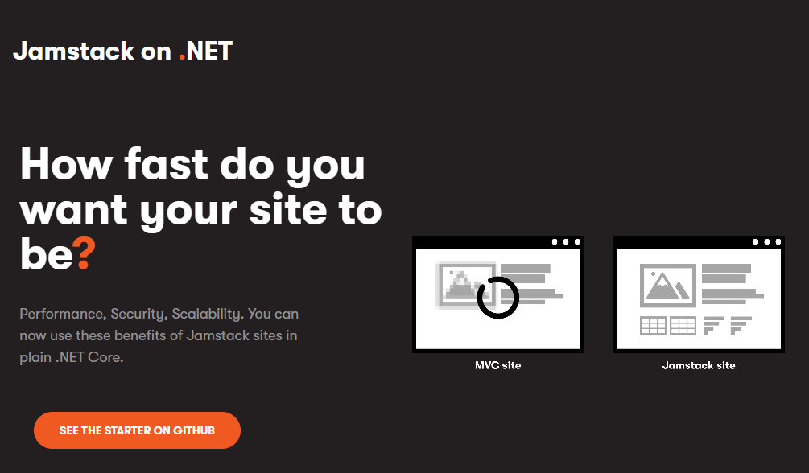



[](https://jamstackon.net)

[](https://stackoverflow.com/tags/kentico-cloud)

# Jamstack on .Net

<https://jamstackon.net>

Microsite utilizing [Statiq](https://statiq.dev/) and [Kentico Kontent](https://kontent.ai) via [Kontent.Statiq](https://github.com/alanta/Kontent.Statiq) module to evangelize the Jamstack world for .NET developers.

[](https://jamstackon.net)

## Get started

### Requirements

- [.NET 5](https://dotnet.microsoft.com/download)

### Clone the codebase

```sh
git clone https://github.com/Kentico/jamstackon.net
```

### Running locally

```sh
dotnet run -- preview
```

🎊🎉 **Visit <http://localhost:5080> and start exploring the code base!**

> The content is loaded from a Kentico Kontent project. Contact [Kontent DevRel team](mailto:devrel@kentico.com) to contribute to the content itself.

### Build

```sh
dotnet run
```

👀 Checkout the `/output` folder for the static site ready to be deployed.
